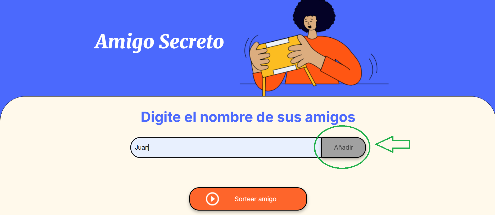
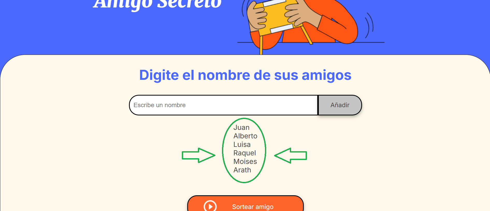
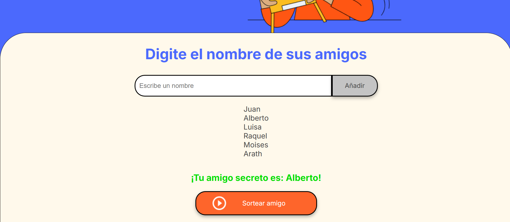

# Juego de Amigo Secreto

## Descripción
El "Juego de Amigo Secreto" es una aplicación web en la que los usuarios pueden agregar los nombres de sus amigos y, al presionar un botón, hacer un sorteo para determinar quién será el amigo secreto de cada uno. El nombre sorteado se muestra en pantalla, creando una experiencia divertida y dinámica para realizar sorteos de manera aleatoria.

## Funcionalidades
1. **Agregar amigos**: Los usuarios pueden ingresar el nombre de sus amigos en un campo de texto. Al hacer clic en el botón "Añadir", el nombre se agrega a una lista.
2. **Sorteo**: Al hacer clic en el botón "Sortear amigo", la aplicación selecciona aleatoriamente un nombre de la lista y lo muestra en pantalla.
3. **Visualización de amigos**: Todos los nombres de los amigos ingresados se muestran en una lista en la pantalla para que los usuarios puedan ver a quiénes han agregado antes de realizar el sorteo.

## ¿Cómo Funciona?

### 1. **Ingreso de nombres**
   - El usuario escribe el nombre de un amigo en el campo de texto y lo añade a la lista haciendo clic en el botón "Añadir". 
   - Si el campo está vacío, aparecerá una alerta pidiendo que ingrese un nombre.
   
### 2. **Lista de amigos**
   - Los nombres de los amigos ingresados se agregan a una lista visible en la pantalla para que el usuario pueda ver las personas que están participando en el sorteo.

### 3. **Sorteo**
   - Cuando el usuario hace clic en el botón "Sortear amigo", un nombre es seleccionado aleatoriamente de la lista de amigos.
   - El nombre sorteado se muestra en la parte inferior de la pantalla, indicando quién será el "amigo secreto".

### 4. **Sin nombres en la lista**
   - Si no se han agregado nombres a la lista y se intenta realizar un sorteo, se muestra una alerta indicando que no hay amigos en la lista.

## Instrucciones para probar el juego

1. **Agrega los nombres de tus amigos**:
   - Ingresa los nombres en el campo de texto.
   - Haz clic en "Añadir" para agregarlos a la lista.

2. **Realiza el sorteo**:
   - Haz clic en el botón "Sortear amigo" para seleccionar aleatoriamente un nombre de la lista.
   - El nombre sorteado se mostrará en la pantalla.

## Archivos del proyecto

- `index.html`: El archivo HTML que contiene la estructura básica del juego.
- `style.css`: El archivo de estilos para la apariencia de la aplicación.
- `app.js`: El archivo JavaScript que maneja la lógica del juego, como agregar amigos y hacer el sorteo.

## Requisitos
Para correr este proyecto, solo necesitas un navegador web que soporte HTML, CSS y JavaScript.

## Cómo ejecutar el proyecto

1. Descarga o clona este repositorio en tu máquina local.
2. Abre el archivo `index.html` en tu navegador.
3. Abre el link del repositorio ya deployado.

## Imágenes de prueba

### Agregar un nombre

### Lista de amigos

### Resultado del sorteo

## Contribuciones
Si tienes alguna sugerencia o mejora para este proyecto, siéntete libre de abrir un _issue_ o hacer un _pull request_.

## Licencia
Este proyecto está bajo la Licencia MIT.

